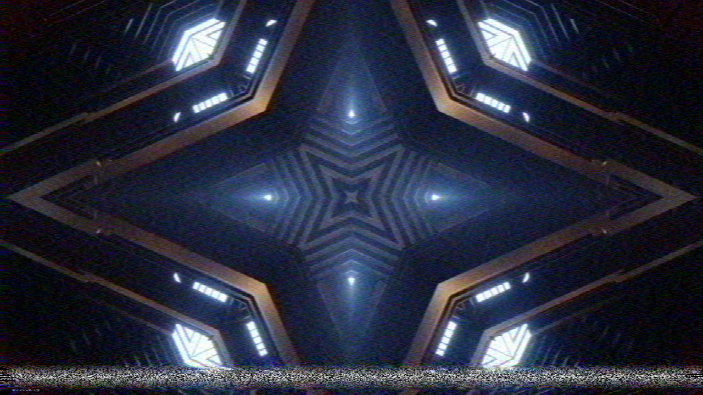
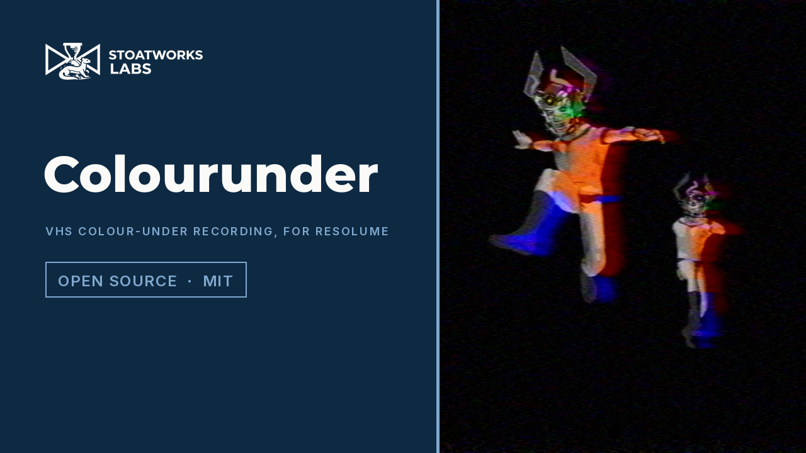

# colourunder

> **AI-assisted project.** This codebase was created with [Claude](https://claude.com/claude-code)
> (Anthropic), directed and reviewed by a human author. The deck is not asserted but
> measured: an offline harness drives the real plugin class in a headless GL context on a
> synthetic clock and reads every property back out of the picture it renders — chroma's
> response, found by bisection on rendered sinusoids, falls to half at 0.50000 MHz (39
> lines) on PAL and NTSC at three rasters, and luma's at the Speed's 3.00 / 2.76 / 2.40 MHz,
> each within 1e-4 MHz; a colour edge's chroma lags its luma by the stated group delay to
> 1e-4 px; the head switch disturbs exactly the lines from 6.5 H before V sync and not one
> row above; a 20° playback phase error is a hue shift of 20° on every NTSC line and, on
> PAL, no hue shift on any line and a saturation of cos 20° to 2e-7; a forced dropout with
> DOC on is, bit for bit, the line 1H before it; a second generation multiplies the chroma
> response by the tape's filter again; the tracking bar is on every field line where the
> stated geometry puts it, for any error and over 20 s of drift; and a resize changes
> nothing — with eight negative controls that prove each check can fail. It has **never
> been loaded into Resolume**; it is loaded by [oxbow](https://github.com/stoatworks-labs/oxbow),
> which is a real FFGL host and is not Resolume. The OpenFX build runs the same per-frame
> C++ and a line-for-line C++ mirror of the shaders, and agrees with the GPU to 7e-7 on
> every pixel compared (never more than one 8-bit level); as a Fusion tool in DaVinci Resolve
> Studio 21.1 on macOS it renders the fleet's own OFX test host's picture to within one 8-bit
> level, and it has **never been loaded into Vegas, Nuke or Natron**. See [Status](#status).

VHS's helical-scan colour-under recording, as an FFGL effect for
[Resolume](https://resolume.com) Arena and Avenue, and as an
[OpenFX plugin](#openfx--resolve-vegas-nuke-natron) for DaVinci Resolve, Vegas, Nuke and
Natron.



<sub>One frame, rendered by `cutest --pipe`, the offline harness — not captured from
Resolume. Resolume's bundled demo clip IntoTheGlow_02 at the defaults, with Tracking up to
0.12 so the bar has left the vertical interval.</sub>

<!-- downloads:start -->

## Download

**[v0.2.0](https://github.com/stoatworks-labs/colourunder/releases/tag/v0.2.0)** — prebuilt for macOS, Windows and Linux. Pick your platform:

<details>
<summary><b>macOS</b> — Universal (Apple Silicon + Intel)</summary>

| Build | Download | Size |
| --- | --- | --- |
| Universal (Apple Silicon + Intel) · .dmg disk image | [`colourunder-0.2.0-macos-universal.dmg`](https://github.com/stoatworks-labs/colourunder/releases/download/v0.2.0/colourunder-0.2.0-macos-universal.dmg) | 255 KB |
| Universal (Apple Silicon + Intel) · .zip archive | [`colourunder-macos-universal.zip`](https://github.com/stoatworks-labs/colourunder/releases/latest/download/colourunder-macos-universal.zip) | 211 KB |
| Universal (Apple Silicon + Intel) · .zip archive (OpenFX — Resolve, Vegas, Nuke) | [`colourunder-ofx-macos-universal.zip`](https://github.com/stoatworks-labs/colourunder/releases/latest/download/colourunder-ofx-macos-universal.zip) | 280 KB |

</details>

<details>
<summary><b>Windows</b> — x64</summary>

| Build | Download | Size |
| --- | --- | --- |
| x64 · .exe installer | [`colourunder-0.2.0-windows-x86_64-setup.exe`](https://github.com/stoatworks-labs/colourunder/releases/download/v0.2.0/colourunder-0.2.0-windows-x86_64-setup.exe) | 228 KB |
| x64 · .zip archive | [`colourunder-windows-x86_64.zip`](https://github.com/stoatworks-labs/colourunder/releases/latest/download/colourunder-windows-x86_64.zip) | 118 KB |
| x64 · .zip archive (OpenFX — Resolve, Vegas, Nuke) | [`colourunder-ofx-windows-x86_64.zip`](https://github.com/stoatworks-labs/colourunder/releases/latest/download/colourunder-ofx-windows-x86_64.zip) | 82 KB |

</details>

<details>
<summary><b>Linux</b> — x64</summary>

| Build | Download | Size |
| --- | --- | --- |
| x64 · .zip archive (OpenFX — Resolve, Vegas, Nuke) | [`colourunder-ofx-linux-x86_64.zip`](https://github.com/stoatworks-labs/colourunder/releases/latest/download/colourunder-ofx-linux-x86_64.zip) | 730 KB |

</details>

All builds, checksums and release notes: [github.com/stoatworks-labs/colourunder/releases](https://github.com/stoatworks-labs/colourunder/releases).

macOS builds are signed and notarised and open normally. The Windows builds are unsigned, so SmartScreen warns once.

<!-- downloads:end -->

## Video

[](https://www.youtube.com/watch?v=nwt7SoegUVM)

Rendered through `cutest --pipe` over Resolume's demo clips (and ffmpeg's generated colour
bars for the PAL/NTSC beat), not captured from Resolume. The head-switch beat is the
bottom-left corner four times up: the torn lines are the last four of each field, under 1%
of the picture's height.

## The one idea

A VHS deck cannot record colour at its broadcast frequency. It heterodynes the chroma
down to about 627 kHz (PAL) or 629 kHz (NTSC), records it under the luma's FM carrier —
the colour-under system — and heterodynes it back up on playback. That one choice, and the
two heads on the spinning drum that lay the picture down diagonally a field at a time, are
what make VHS look like VHS.

## What falls out

None of these is drawn as an effect. Each is the recorder doing what it does:

- **Colour smears, and arrives late.** The colour-under band is about half a megahertz
  wide, so chroma has about 40 lines of horizontal resolution against luma's 240, and the
  playback filters delay it: colour bleeds right of every edge.
- **Colour noise is blotches.** Noise on the colour-under band goes through the same
  narrow filter, so it comes out as streaks of colour a few microseconds long, not grain.
- **Hue wanders on NTSC; PAL goes pale instead.** The playback's phase error rotates the
  colour. PAL inverts its V axis on alternate lines, so after the 1H average the rotation
  cancels and only a loss of saturation is left. NTSC keeps the hue shift.
- **The bottom tears.** The deck switches heads 6.5 lines before vertical sync; the new
  head's timing is not the old one's, so the last lines of each field jump sideways and the
  TV takes a dozen lines to catch up.
- **The tracking bar.** Off-track, the head reads the wrong track where it crosses between
  two of its own, and the FM demodulator loses lock: a band of noise, colour gone, lines
  jittering. At good tracking it rests in the vertical interval; as the error drifts it
  walks up through the picture.
- **Dropouts.** Missing oxide is a white streak — or, with DOC on, the same stretch of the
  line before, repeated.
- **SP, LP, EP.** Slower tape: less luma bandwidth, more noise.
- **Copies of copies.** A dub runs the whole chain again: colour at 0.35 MHz after two
  generations, twice the delay, the noise and the dropouts of both tapes.

### How it differs from Ferric and Old Cathode

[Ferric](https://github.com/stoatworks-labs/ferric) is the tape transport (wow, flutter and
scrape as one timing error) and a noise-reduction round trip; Colourunder has neither.
[Old Cathode](https://github.com/stoatworks-labs/old-cathode) is the broadcast composite route
to a CRT (a subcarrier, dot crawl, cross-colour, the tube); Colourunder never makes a
composite, so there is no dot crawl and no cross-colour, and its head switch and tracking bar
come from the recorder's own geometry (a stated line before V sync; the crossing between two
tracks) rather than a band placed on the frame. AGENTS.md has the detail.

### The honest limit

The chroma path is the colour-under band's baseband equivalent — a Gaussian band edge and
a pure delay, not a heterodyne or a real deck's filters — and the chroma bandwidth itself
is one of the less certain numbers (the sources say 300 or 500 kHz; this is 500). There is
no composite between generations, so a dub adds no cross-colour; no pre-emphasis clipping,
so there is no white streaking after sharp edges. The noise levels, the tracking geometry
and the head-switch step are chosen, not measured from a deck. ATTRIBUTIONS.md says which
figures are sourced.

## Controls

| Group | |
| --- | --- |
| **Deck** | Standard (PAL, NTSC), Speed (SP, LP, EP), Tracking (the tracking error: at 0 the bar hides in the vertical interval), Head Switch (the head-to-head time-base step, 0–2 µs). |
| **Tape** | Wear (dropouts, and a little RF), Generation (1–5 copies), DOC (the dropout compensator). |
| **Colour** | Chroma Delay (the playback filters' group delay, 0–1 µs), Chroma Noise (band-limited colour noise and the playback phase error), Mix. |

The defaults are a PAL LP recording played on a well-adjusted deck: a little tracking
error, a visible head-switch tear at the bottom, a few dropouts compensated, the colour
0.45 µs late with some blotch. Chosen on Resolume's demo clips. The output is opaque at
Mix 1: a tape has no alpha.

## OpenFX — Resolve, Vegas, Nuke, Natron

The same deck also builds as an OpenFX plugin — **Colourunder**, under **Stoatworks** in
the host's effects list (`com.stoatworks.colourunder`) — a CPU render for DaVinci Resolve,
Vegas Pro, Nuke and Natron, on macOS (universal), Windows and Linux. It ships from v0.2.0,
as three zips beside the Resolume downloads: `colourunder-ofx-macos-universal.zip`,
`colourunder-ofx-windows-x86_64.zip` and `colourunder-ofx-linux-x86_64.zip`. Copy
`Colourunder.ofx.bundle` into the system's OpenFX folder and restart the host:

```
macOS    /Library/OFX/Plugins/
Windows  C:\Program Files\Common Files\OFX\Plugins\
Linux    /usr/OFX/Plugins/
```

The Linux build is made against glibc 2.28, so it loads on Rocky 8 — the Linux Resolve
supports — and on anything newer.

**What is the same.** All ten controls, with the same names, ranges, defaults and groups
(Standard and Speed are choices, Generation an integer 1–5, DOC a checkbox). The whole CPU
half of the plugin is the same code, not a port: `frame::Make` (`source/Frame.cpp`) works
out the kernels, the tracking error and its bar, the head switch, the phase error, the
dropouts and the noise seeds for both builds. What exists twice is only the per-pixel work
of the seven shaders, mirrored line for line in `source/CpuPasses.cpp` and marked
`//= mirrored` on both sides; `cutest --cpu` renders both on the same frames and they
agree to 7e-7, never more than one 8-bit level apart.

**What differs.**

- **The tape's clock is the clip's time.** In Resolume it is the time since the effect
  started, because FFGL hands a plugin one frame at a time. OpenFX renders frames in any
  order, alone and on several threads, so here it is the frame's own time (frame number ÷
  frame rate; PAL's 25 fps when the host gives none). The tracking drift, and the noise,
  the dropouts, the phase error and the bar's jitter that change with each video frame (25
  or 29.97 a second), were already a
  pure function of that time, so a frame renders the same alone, in order, backwards or
  twice, and scrubbing back shows the same tape. Nothing is carried from one frame to the
  next, and the plugin asks the host for no other frames: a tape has no memory of the frame
  before.
- **Standard and Speed are not keyframeable** (choice parameters, as in the fleet's other
  OpenFX ports). The sliders, Generation and DOC are.
- **A straight-alpha clip** is multiplied by its alpha on the way in and divided on the
  way out, so both conventions record the picture over black, as the Resolume build does
  with Resolume's premultiplied clips. At Mix 1 the output is opaque either way.
- **Mix 0** is reported to the host as an identity, so the host skips the render.
- **A proxy or reduced-resolution render** runs the deck at that resolution. The
  bandwidths, the delay, the head switch and the line count are set in microseconds and
  lines and do not change; the noise is drawn per sample, so its pattern is not the
  full-resolution render's.
- **The About block** is a folded group with a credit line and link buttons, where
  Resolume shows a text parameter and event buttons.

Nothing is dropped: the Resolume build has no audio input, no beat sync and, outside the
About block's link buttons, no momentary buttons, so every control means the same thing in
both.

**Cost.** On an Apple M4 Max, `cpu::Render` at 1920×1080 takes 4.1 ms a frame at the
defaults and 12.0 ms at Generation 5 (Tracking 1, Wear 1) on 8 threads, 28 and 83 ms on
one; at 3840×2160, 9.5 and 17.6 ms on 8 threads. Inside an OpenFX host (the fleet's test
host, its own 8-thread pool, 8-bit frames converted in and out) a 1920×1080 frame takes
6.1 and 14.4 ms, a 3840×2160 one 16 and 24 ms (medians of ten). The line raster is at
most 1024 samples by 576 lines whatever the frame size, so only the intake and the
display grow with it.

## Status

**v0.2.0, which adds the OpenFX build, and honestly early.** (v0.1.0, the Resolume build
alone, was released 25 September 2026.) There is a
[user guide](https://stoatworks-labs.com/software/colourunder/guide/)
([PDF](docs/USER-GUIDE.pdf)) and a [project page](https://stoatworks-labs.com/software/colourunder/).

### Measured offline, on macOS

`tools/verify.sh` passes on this machine against a fresh universal Release build, running
every check at 320×180, 960×540 and 1280×720 and again on Apple's software renderer at
320×180. What it establishes:

- **Chroma** half amplitude at 0.50000 MHz on PAL (39.0 lines) and NTSC (39.5 lines), at
  every raster, within 1e-5 MHz; **luma** at 3.0000, 2.7600 and 2.4000 MHz for SP, LP and EP
  where the raster can carry the band edge (960 and 1280 wide; at 320 wide Nyquist is 3.08
  MHz, and the check says so and asserts only that luma is not chroma's).
- **Delay.** Chroma lags luma by the stated delay, 5.00000 px when it is a whole number of
  pixels and 2.77192 against 2.77190 px when it is not, from the edge and from the phase.
- **Head switch.** On PAL frame line 568 (field line 284) is the first disturbed line and on
  NTSC line 236 is cut 22.38 µs in; no row above changes, every row below is torn.
- **PAL and NTSC.** A 20° phase error: PAL no hue shift on any row (≤ 2.2e-7 rad),
  saturation cos 20° (≤ 2.0e-7); NTSC 20° of hue on every row, saturation kept.
- **DOC.** A forced dropout on line 289 (PAL) or 241 (NTSC) with the noise on is line 287's
  or 239's exactly, on the line raster and on screen; with DOC off a white streak.
- **Generations.** Generation 2 over generation 1 is the tape's 0.5 MHz Gaussian to 1.2e-4;
  two generations' chroma half amplitude 0.35356 MHz against 0.5/√2; the delay doubled.
- **Tracking.** The chroma lost on every field line matches the stated geometry to 2.4e-7
  for nine errors and 51 frames of 20 s of drift; the bar hides at no error and widens as it
  enters; the same second is the same error at 60 and 144 fps.
- **Resize.** A resize to 1.5× and back leaves every subpixel as it would have been.
- **Negative controls.** Chroma given luma's bandwidth fails the chroma; no delay, the
  delay; a switch counted from the wrong place, the switch; PAL without its average, PAL;
  DOC repeating the other field, DOC; one generation's filter, the generation; a bar that
  ignores the error, the tracking; a resize that restarts the clock, the resize.
- **No dead controls**: all 10 change the picture.
- **The bundle** is universal, and oxbow sees `SW Colourunder`, `CU01`, an effect.
- **The OpenFX build against the GPU** (`cutest --cpu`, the same frames of the moving card
  through the plugin's GL passes and through `cpu::Render`, noise on, five frames over a
  second at each of four settings from the defaults to NTSC with everything up and EP at
  Generation 5): worst float difference 6.6e-7 at every raster and on the software
  renderer, never more than one 8-bit level (939 of 166 million values at 1920×1080); the
  render split over threads is the serial one bit for bit; and the plugin at Chroma Delay
  0.45 against the CPU at 0.46 fails the comparison, as it must. A one-character slip in the
  mirror (PAL's V switch on every other pair of lines; one Catmull-Rom weight) fails it by
  up to 72 levels.
- **The OpenFX bundle in an OpenFX host**: ofxprobe (resolume-ofx-bridge's test host, and
  a build of it with image and sequence inputs, time, frame rate and batches) loads it from
  the build, sees its ten controls and the About group, and renders it. A moving hard-edged
  colour card, as a sequence, through `cutest --pipe` (frames in order from 0) and through
  the host (seven frames from 0 to 61 rendered out of order in one instance), at four
  settings, at 640×360 and 25 fps, 1280×720 and 60 fps, and 640×360 and 29.97 fps in float:
  every frame within 1/255, at most 0.026 % of values differing (the Mix 0.5 setting;
  0.0014 % at the others); Chroma Delay 0.45 against 0.46 differs on 15 %. On the stock
  probe's own ramp at time 0 the same, except that at Mix 0.5 1.1 % of values differ by
  one — all but 6 of them values lying on an exact half level, which the plugin's `lround`
  rounds up and the GPU's conversion rounds down.
- **Out of order is the same picture**: frame 40 rendered alone, after frames 0–39 in one
  instance, and after 60 down to 41, is byte-identical, at the defaults and at Generation
  5; frame 39 differs from it, because the tape moves. The plugin asks the host for the
  source at the render time only, and with every other fetch refused the frame is
  unchanged. Mix 0 is reported as an identity and the host's copy is the input exactly.

Render cost, `cutest --bench` (best of three, `glFinish` both sides, a shared GPU):

| | defaults ms/frame | Generation 5, Tracking 1, Wear 1 | state held |
| --- | --- | --- | --- |
| 1280×720 | 0.48 | 1.80 | 39 MB |
| 1920×1080 | 0.93 | 3.65 | 59 MB |
| 3840×2160 | 1.42 | 4.10 | 76 MB |

4K costs little more than 1080p because the signal chain runs on a line raster of at most
1024 samples by 576 lines, whatever the host's size.

### In Resolume on Windows

A build of this source (release.yml on c30a11b) loads, registers and renders in Resolume
Arena 7.27.1 on win-lab (software rendering, Mesa llvmpipe, no GPU): the fleet's Arena gate
passed 9 of 9, with all 16 host controls matching what the plugin declares. Opacity, Mix,
Generation and Chroma Delay read as moving the picture; Standard, Speed, Tracking, Head
Switch, Wear, DOC and Chroma Noise inconclusive, because the tape noise and dropouts refresh
every video frame and set the gate's noise floor (5.3 levels). The harness sweep shows all
10 change the picture. Software rendering says nothing about a GPU or about speed.

### In DaVinci Resolve on macOS

The OpenFX build loads in DaVinci Resolve Studio 21.1 and renders as a Fusion tool (MediaIn,
Colourunder, MediaOut, a render job to PNG; 1920×1080, 32-bit float). Six frames of a
colour-bar sequence at Generation 3, Chroma Noise 0.8 and Wear 0.6 are ofxprobe's render
of the same frames at 24 fps to within one 8-bit level: the first identical, the
others at most 4 pixels of 2 073 600 one level apart. Fusion gave the source clip no frame
rate and the effect 24, so the build's 25 fps fallback was not reached. It has been tried
only as a Fusion tool, and nothing was timed.

### What filming found

- The tracking bar moves less than the control suggests: at Tracking 0.3 it is still in the
  bottom tenth of the picture most of the time; near 1 it reaches the upper half, wandering
  up and down with the drift.
- The head-switch tear is the last four lines of each field, about 7 px of 1080, so at full
  frame it is a thin strip; the video shows it four times up.
- A hue error can only be seen on flat colour, so the PAL/NTSC beat uses ffmpeg's generated
  SMPTE bars: PAL steady, NTSC in hue bands down the picture at Chroma Noise 1.

### Not done

- **Never loaded into Resolume on macOS.** On Windows, see above.
- **The OpenFX build has never been loaded into Vegas, Nuke or Natron**, and into DaVinci
  Resolve only on macOS, as a Fusion tool (see above). ofxprobe is a real OFX host and is
  none of them: Filter context only, render scale 1, 8-bit and float RGBA, premultiplied,
  no proxies, no tiles, no 16-bit, macOS arm64 only. The Windows and Linux OpenFX builds
  are compiled by CI, and the Linux one is loaded (dlopen and the two entry points) on
  Rocky 8, but neither has rendered a frame in any host.
- Seen only on Resolume's bundled demo clips and generated bars, never on camera footage.
- No factory presets.

## Browser demo

[colourunder-demo.stoatworks-labs.com](https://colourunder-demo.stoatworks-labs.com/) runs
the plugin's own intake, noise, tape, comb, compensator and display shaders in WebGL2,
spliced in from `source/Shaders.cpp` by `demo/tools/sync_shaders.py` and checked by
`demo/tools/check_shaders.py` from `tools/verify.sh` against what `cutest --dump-shaders`
says the plugin compiles, over the same RGBA32F line raster. Its CPU half — the kernels,
the tracking error and bar, the head switch, the dropouts, the phase error, the clock and
every control's law — is a hand port to JavaScript (`demo/model.js`), and the page says so.
`demo/tools/check_port.sh` (also run by verify) compiles the plugin's own constructor and
`ProcessOpenGL` with GL replaced by a recorder and finds the port identical on every
declaration, LineData float and uniform. Driven frame by frame against `cutest --pipe
--fps 60` on the same input it agrees to 1/255 on every pixel. Generated clips only, or your
own image or video, which never leaves the page.

## Build

Needs CMake 3.15+, a C++17 compiler and the FFGL SDK submodule.

```sh
git clone --recurse-submodules https://github.com/stoatworks-labs/colourunder
cd colourunder
cmake -B build -DCMAKE_BUILD_TYPE=Release
cmake --build build --parallel
```

The macOS bundle is universal (Apple Silicon and Intel). `cmake --install build` copies it
into `~/Documents/Resolume Arena/Extra Effects`; for Avenue, pass
`--prefix "$HOME/Documents/Resolume Avenue/Extra Effects"`.

The same build makes `build/Colourunder.ofx.bundle`, the OpenFX plugin; copy it into
`/Library/OFX/Plugins` yourself (nothing installs it). `-DBUILD_OFX=OFF` leaves it out;
`-DCOLOURUNDER_BUILD_FFGL=OFF` builds it alone, with no FFGL SDK, no GLEW and no GL at all,
which is how the Linux build is made.

## Building and testing

```sh
tools/verify.sh                                   # everything, ~15 minutes
./build/cutest --list                             # the parameters
./build/cutest --chroma --size 320x180            # one check
./build/cutest --negative                         # every check can fail
./build/cutest --cpu                              # the OpenFX build's CPU passes against the GPU's
python3 tools/sweep.py                            # no dead controls
ffmpeg -i clip.mov -vf fps=60 -f rawvideo -pix_fmt rgba - | ./build/cutest --pipe --size 1280x720 | ffplay -f rawvideo -pixel_format rgba -video_size 1280x720 -framerate 60 -
```

`CLAUDE.md` is the command reference and `AGENTS.md` the reasoning: the recorder, the
traps, which figures are sourced, and where every tolerance comes from.

## License

MIT — see [LICENSE](LICENSE). What it builds on is in [ATTRIBUTIONS.md](ATTRIBUTIONS.md).

<!-- attributions:start -->
This project is built on other people's work — see [ATTRIBUTIONS.md](ATTRIBUTIONS.md).
<!-- attributions:end -->
