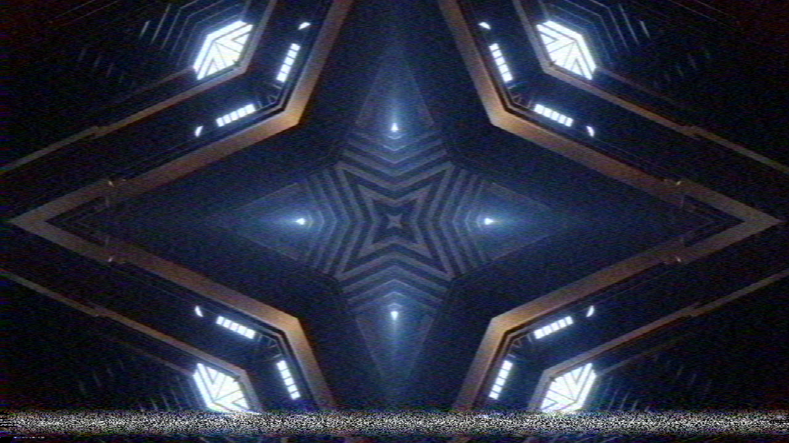

# Colourunder user guide

Colourunder is **VHS's helical-scan colour-under recording, for [Resolume](https://resolume.com)
Arena and Avenue**, as an FFGL effect. It does not paint a "VHS look" over the clip. It records the
clip the way a VHS deck does and plays it back: the colour heterodyned down under the luma's FM
carrier and back up again, two heads on a spinning drum laying the picture down a field at a time,
a tracking servo that is never quite on the track, and oxide that is sometimes missing. The soft,
late colour, the blotchy colour noise, the torn bottom lines, the walking noise bar and the
repeated dropouts are what that recorder does.



*Resolume's bundled demo clip IntoTheGlow_02 at the defaults, with Tracking up to 0.12 so the bar
has left the vertical interval. Rendered by the offline harness, not captured from Resolume.*

> **Before you rely on this:** released at **v0.1.0**, and honestly early. The deck is measured
> rather than asserted, by a harness that drives the real plugin class and reads each claim back
> out of the picture it renders, at 320 × 180, 960 × 540 and 1280 × 720 and again on Apple's
> software renderer: chroma's response falls to half at 0.50000 MHz (39 lines) on PAL and NTSC,
> luma's at 3.00, 2.76 and 2.40 MHz for SP, LP and EP where the raster can carry it; a colour
> edge's chroma lags its luma by the stated delay to 1e-4 px; the head switch disturbs exactly the
> lines from 6.5 H before vertical sync and not one row above; a forced 20° playback phase error is
> 20° of hue on every NTSC line and, on PAL, no hue shift on any line and a saturation of cos 20°;
> a dropout with DOC on is, bit for bit, the line 1H before; a second generation multiplies the
> chroma response by the tape's filter again; the tracking bar sits on every field line where the
> stated geometry puts it; and a resize changes nothing. Eight deliberately broken models are each
> shown to fail their check, and all 10 controls are shown to change the picture. **The checks
> verify the stated model, not a real deck**, and several of the format's numbers are weakly
> sourced or unsourced: see Where the numbers come from, which says which. On macOS it has **never
> been loaded into Resolume**; the one host it has run in there is the fleet's own test host,
> `oxbow`.
> On Windows it has: a build of this source loads, registers and renders in Resolume Arena 7.27.1 on software rendering (win-lab, Mesa llvmpipe, no GPU), with all 16 host controls matching what the plugin declares, in the fleet's Arena gate (9 of 9 checks). The gate's picture is a still, and the tape noise and dropouts change every frame, so the picture never stands still: Opacity, Mix, Generation and Chroma Delay read as moving it, and the other seven controls came back inconclusive against that noise floor rather than dead. Software rendering says nothing about a GPU or about speed.
> Try it on a spare layer before you put it in a show.
>
> This codebase was created with AI assistance, directed and reviewed by a human author.

---

## Installing

Every download carries one effect, **SW Colourunder**. Drop it into Resolume's effects folder and
restart Resolume:

```
macOS    ~/Documents/Resolume Arena/Extra Effects/
Windows  %USERPROFILE%\Documents\Resolume Arena\Extra Effects\
```

Avenue uses the same layout under its own folder name. The effect then appears in the effects
browser as **SW Colourunder**.

The macOS download is a universal build (Apple silicon and Intel), as a `.dmg` or a `.zip`.
It is Developer ID-signed and notarised by the release pipeline after publication, so the bundle
simply loads; if macOS refuses a download, it predates the signing — download it again. The Windows download is an x64 installer or a `.zip`. It is not
code-signed, so the installer trips SmartScreen once: **More info** → **Run anyway**.

---

## The recorder, not the look

A VHS deck cannot record colour at its broadcast frequency: the tape and heads cannot carry a
4.43 MHz (PAL) or 3.58 MHz (NTSC) subcarrier alongside the luma. So the deck **heterodynes the
chroma down** to about 627 kHz (PAL) or 629 kHz (NTSC) and records it under the luma, which is
frequency-modulated onto a carrier between about 3.4 and 4.8 MHz. On playback the chroma is
heterodyned back up. That is the colour-under system, and it and the rotating heads are where
everything in this plugin comes from:

| the stage | what comes out |
| --- | --- |
| chroma recorded as a narrow band under the FM luma | **colour smears**: half amplitude at 0.5 MHz, about 39 lines of chroma against luma's 234 at SP |
| the playback filters' group delay | **colour arrives late**, right of every edge |
| noise added to the colour-under band, then the same filter | **blotches, not grain**: horizontal streaks of colour noise |
| FM luma: noise rising with frequency, then de-emphasis | fine horizontal luma noise, more at LP and EP |
| a playback phase error, per line, smooth down the field | **NTSC: the hue wanders. PAL: the alternating V axis and the 1H average turn it into desaturation** |
| the 1H comb (NTSC's crosstalk canceller, PAL's delay line) | chroma's vertical resolution halved, on both standards |
| two heads, switching 6.5 H before vertical sync | **the bottom lines tear sideways**, with a switching transient across them |
| the head's path against the recorded track | **a noise bar** where it reads the wrong track; it rests in the vertical interval and walks up the picture as the tracking error drifts |
| missing oxide | a white streak, or with **DOC** the same stretch of the line 1H before, repeated |
| a copy of a copy | the whole chain again: colour at 0.35 MHz after two generations, the delay twice, the noise added again |

None of these is drawn as an effect. Each is the recorder doing what it does.

### How this differs from Ferric and Old Cathode

Stoatworks has two neighbours in this corner, and Colourunder is built not to repeat them.

- **[Ferric](https://stoatworks-labs.com/software/ferric/)** is the tape transport and the
  noise-reduction round trip: wow, flutter and scrape as one timing error in tape time, and a
  compander that encodes before the tape and decodes after it. Colourunder has neither. Its only
  time-base errors are the head switch's step and the lost sync inside the tracking bar, and it
  has no compander.
- **[Old Cathode](https://stoatworks-labs.com/software/old-cathode/)** is the broadcast composite
  route to a CRT: a subcarrier, dot crawl, cross-colour, ghosting, interlace twitter, the tube.
  Colourunder never makes a composite. Its chroma is band-limited as a baseband U/V pair, the
  colour-under band's equivalent, so there is **no dot crawl and no cross-colour**, and there is no
  CRT. Where the two overlap, Colourunder uses the recorder's own mechanism: Old Cathode's head
  switch is a smoothstep over the bottom few percent of the frame, Colourunder's lands on a stated
  line (6.5 H before V sync) and recovers over the TV's AFC; Old Cathode's tracking band is a
  sine-driven position of fixed width, Colourunder's bar is where the head crosses between two
  tracks of its own azimuth; and Old Cathode's PAL average is of two decoded composite lines,
  Colourunder's is of the colour-under chroma and applies to NTSC too.

They stack: Colourunder into Old Cathode is a VHS tape played into a CRT.

---

## Start here

Drop **SW Colourunder** on a clip. The defaults are a PAL LP recording played on a well-adjusted
deck: the colour soft and 0.45 µs late with some blotch, a little tracking error so the bar mostly
hides in the vertical interval and now and then flicks the bottom lines, a visible head-switch
tear at the very bottom, a few dropouts compensated. The output is opaque at Mix 1: a tape has no
alpha.

Then:

- **Colour on black shows the chroma best.** Saturated colour with hard edges (a figure on black)
  makes the ~40-line chroma and its delay obvious: grey luma edges on the left of every coloured
  shape, colour bleeding right.
- **Tracking walks the bar.** Raise Tracking slowly from 0 to 1 and the noise bar climbs out of the
  vertical interval and up the picture, wandering up and down as the error drifts. It moves less
  than the control suggests: at 0.3 it is still in the bottom tenth of the picture most of the
  time, and near 1 it reaches the upper half (found while filming the video).
- **Standard decides what the phase error does.** Raise Chroma Noise to 1 and switch between PAL
  and NTSC on a flat colour: PAL fades a little, NTSC's hue wanders in bands down the picture.
- **Generation is the dub.** Each step is another copy of the tape, through the whole chain again.

---

## The Deck group

**Standard** — PAL or NTSC. It sets the raster (576 or 480 active lines, two fields), the
colour-under carrier (626.953 or 629.371 kHz, informational: see How it works), where the head
switch falls, the video frame rate the noise refreshes at (25 or 29.97 a second), and — the one
you can see — what a playback phase error does. NTSC shows it as a hue shift; PAL inverts its V
axis on alternate lines, so after the 1H average the rotation cancels and only a loss of
saturation is left.

**Speed** — SP, LP or EP. Slower tape: less luma bandwidth (half amplitude at 3.0, 2.76 and
2.4 MHz) and more FM noise. LP is the default, the characteristic home-recording look. Only SP's
figure is confirmed; LP's is from one source and EP's from none (see Where the numbers come from).

**Tracking** — the tracking error, in track pitches. With a fixed slope the head crosses two track
pitches a field, so there is exactly one crossing a field, where it reads the wrong track and the
FM demodulator loses lock: a band about 19 lines deep of noise, colour gone, lines jittering. At 0
the crossing rests in the middle of the vertical interval and you see no bar (only a little extra
noise on the bottom few lines, as on a real, well-tracked VHS). As the error rises the bar enters
from the bottom and climbs; it is fully on screen by about 0.15. The error is not constant: it
drifts, ± 80 % around the value you set, on a seeded wander through knots 1.7 s apart, so the bar
walks.

**Head Switch** — the head-to-head time-base step, 0 to 2 µs. The deck switches heads 6.5 lines
before each field's vertical sync; the new head's timing is not the old one's, so the lines after
the switch jump sideways by this much and the TV's AFC pulls them back over about 12 lines. A 2 µs
switching transient crosses those lines at any setting. The switch lands 4.0 lines before the end
of a PAL field's active picture and 3.5 on NTSC, so on NTSC it cuts a line in half, 22.38 µs in.
The default 0.45 is 0.9 µs. The torn lines are only the last four of each field, under 1 % of
the picture's height (about 7 pixels of a 1080-line composition), so at full frame the tear is a
thin strip along the bottom edge; the video shows it four times up.

---

## The Tape group

**Wear** — dropouts, and a little extra RF noise. Up to 24 dropouts a generation a frame, 12 ×
Wear² expected, each 1 to 21 µs long, at random places. At 0 there are none.

**Generation** — 1 to 5: how many copies deep. Each generation is another deck: the chroma and
luma filters again, the delay again, the noise and the dropouts of that tape, and the head switch
again, in the same place, so its step accumulates. Two generations put chroma's half amplitude at
0.35 MHz (0.5/√2), the delay twice.

**DOC** — the dropout compensator. Off, a dropout is a white streak with no colour. On, the deck
repeats the same stretch of the line 1H before (the previous line of the same field), luma and
chroma together, from the nearest clean line.

---

## The Colour group

**Chroma Delay** — the playback filters' group delay, 0 to 1 µs: how late the colour arrives, right
of the luma. The default 0.45 µs is a second-order Butterworth's group delay at 0.5 MHz. At 0 the
colour is still smeared, but centred on its edges.

**Chroma Noise** — band-limited colour noise and the playback phase error together. The noise is
added to the colour-under band and filtered with it, so it comes out as horizontal blotches of
colour a few microseconds long. The phase error (up to 15° standard deviation at 1) moves smoothly
down the field: NTSC turns it into hue, PAL into desaturation.

**Mix** — back to the clip. At 1 the output is fully opaque; below 1 the output's alpha moves back
toward the clip's.

---

## Where the numbers come from

Several of the format's figures are weakly sourced, and one important one is disputed. This is the
honest state of each. ATTRIBUTIONS.md in the repository has the sources in full.

| figure | value here | status |
| --- | --- | --- |
| PAL colour-under carrier | 40.125 fH = 626.953 kHz | **confirmed**: vhs-decode (citing IEC 774-1), a digital-archivist.com article and US patent 5,500,739 agree |
| NTSC colour-under carrier | 40 fH = 629.371 kHz | **confirmed**, the same three |
| **chroma bandwidth** | half amplitude at **0.5 MHz** (39.0 lines PAL, 39.5 NTSC) | **unconfirmed, and the sources disagree.** US patent 5,500,739 and the spec this was built from give sidebands of about ± 500 kHz; Wikipedia gives 300 kHz of baseband chroma. 0.3 MHz would be 23 lines, not 39. The plugin reads the patent's sideband extent as the half-amplitude edge |
| luma, SP | half amplitude 3.0 MHz (234 lines PAL) | **confirmed**: Wikipedia's 3 MHz and 240 TVL agree with each other |
| luma, LP | 2.76 MHz (3.0 × 230/250) | **unconfirmed**: one source's line counts, from an earlier revision of the same article |
| luma, EP | 2.4 MHz | **unconfirmed: no source gives a number.** Chosen below LP |
| head switch | 6.5 H before V sync (± 1.5 H) | **confirmed**: four US patents quoting the VHS standard |
| where that falls in the picture | 4.0 lines before a PAL field's active end, 3.5 on NTSC | **derived** from BT.470-6 and SMPTE 170M line numbering |
| de-emphasis corner (shapes the FM noise) | 273.76 kHz | **unconfirmed** beyond vhs-decode, which cites IEC 774-1 p. 67 |
| noise levels, AFC time constant, head-switch step, tracking slope and threshold, dropout rate and length, phase-error size | see the controls above | **chosen**, not sourced |

The IEC 774-1 standard itself was not read: every "IEC" figure above is second-hand.

---

## How it works

The host picture is averaged down onto the standard's lines (576 or 480, two fields interleaved),
each line sampled at up to 1024 points. Then, per generation, a noise pass, a **tape** pass (the
luma through the Speed's filter plus FM noise; the chroma through the colour-under filter with its
delay plus band-limited noise; the tracking bar; the switching transient; the phase rotation; the
dropouts flagged), a **comb** pass (chroma averaged with the line 1H before in the same field) and
a **DOC** pass. Finally each host row shows its nearest line, reconstructed across with a
Catmull-Rom filter and displaced by that line's time-base error.

- **The chroma path is baseband U/V**, not an actual heterodyne at 627 kHz. For the linear parts
  the two are the same, and the carrier shows only through the bandwidth.
- **The band edges are half-amplitude (−6 dB) points** of a Gaussian response plus a pure delay.
  A real deck's filters are neither Gaussian nor linear-phase; the Gaussian is what makes the band
  edge and the delay separately measurable. The filters are designed with the display's and the
  intake's own losses included, so the whole chain is half at the stated frequency at any size.
- **Y′UV is BT.601 with PAL's U and V scalings for both standards** (no YIQ for NTSC).
- **Everything per line is computed on the CPU in double** — the tracking geometry and drift, the
  head switch, the phase error's cosine and sine — and handed to the shaders, which do no
  trigonometry. Time is seconds since the first frame, in double, so the tracking drift is the same
  at any frame rate.

---

## Performance

Measured by the offline harness on an M4 Max, best of three, `glFinish` both sides, on a GPU shared
with other work:

| | defaults, ms a frame | Generation 5, Tracking 1, Wear 1 | memory held |
| --- | --- | --- | --- |
| 1280 × 720 | 0.48 | 1.80 | 39 MB |
| 1920 × 1080 | 0.93 | 3.65 | 59 MB |
| 3840 × 2160 | 1.42 | 4.10 | 76 MB |

4K costs little more than 1080p because the signal chain runs on a line raster of at most 1024
samples by 576 lines, whatever the composition's size. Nothing was timed inside Resolume, and
nothing was timed on Windows.

---

## If it looks wrong

**There is no tracking bar.** At low Tracking it rests in the vertical interval, below the
picture. Raise Tracking past about 0.1.

**The bar will not stay still.** It should not: the tracking error drifts. There is no control for
the drift rate in this version.

**The colour looks fine.** On a picture with little saturated colour, or on soft shapes, the
~40-line chroma hides. Try colour with hard edges on black.

**Nothing happens when I switch PAL and NTSC.** The difference is in the phase error, which is part
of Chroma Noise: raise it, and look at a flat colour.

**The picture is soft even at SP.** Luma is band-limited at every speed (3 MHz at SP is about 234
lines across the picture), and a small composition has fewer host pixels than the deck has lines.

**The bottom few lines are always disturbed.** That is the head switch, 6.5 lines before vertical
sync, and the noise flank of a tracking bar resting in the vertical interval. Head Switch 0 removes
the step; the 2 µs switching transient stays.

**SW Colourunder is not in the effects browser.** Check the folder under Installing, and that
Resolume was restarted.

**The effect does nothing at all.** A shader that will not compile looks exactly like that, and the
real message is in the log:

```
macOS    ~/Library/Logs/colourunder/colourunder.YYYY-MM-DD.log
Windows  %LOCALAPPDATA%\colourunder\logs\colourunder.YYYY-MM-DD.log
```

---

## Known limits

- **The chroma bandwidth is disputed** (0.5 MHz here, 0.3 MHz in another source), and the LP and
  EP luma figures are weakly sourced or not sourced at all. See Where the numbers come from.
- **The filters are Gaussian with a pure delay**, not a real deck's; there is no heterodyne.
- **No composite between generations**, so a dub adds no cross-colour; no pre-emphasis clipping,
  so there is no white streaking after sharp edges; no azimuth crosstalk; no audio.
- **Both fields switch heads at the same place**, and each field is treated as whole lines: a real
  deck puts one field's switch mid-line, and PAL's and NTSC's half lines are not modelled. The
  head-switch step has the same sign at both switches.
- **The tracking bar's core is a fixed ~19 lines** once on screen. What grows with the error is how
  much of it has left the vertical interval, not its own width.
- **The drift rate is fixed** (knots 1.7 s apart), and not tempo-synced.
- **Never loaded into Resolume on macOS.** Everything numeric was compiled, rendered and measured
  offline against the real plugin class in a headless CGL context, plus an `oxbow` load.
- **Never seen on camera footage**, only on Resolume's bundled CG loops and generated bars.
- **Only ever run on an Apple M4 Max**, although the macOS build contains an Intel slice. On
  Windows, see the note at the top of this guide.
- **No presets and no OpenFX version.**
- **There is a browser demo** at [colourunder-demo.stoatworks-labs.com](https://colourunder-demo.stoatworks-labs.com/).
  It is a port to a web page, not the plugin: the eight shaders run in WebGL2 unedited, and the
  per-line CPU half (the tracking geometry and drift, the head switch, the phase error, the
  dropouts) is rewritten in JavaScript and checked against the C++ by a script in the repository.
  It needs float render targets and more fragment uniforms than WebGL2 promises; the page lists
  what it does not reproduce.

---

## About

The last group, **About**, carries the plugin's name, version, licence and maker, and buttons that
open this user guide ([stoatworks-labs.com/software/colourunder/guide/](https://stoatworks-labs.com/software/colourunder/guide/)),
the project page, the source on GitHub and the support page in your browser.

VHS is a format; the plugin is not affiliated with, or endorsed by, JVC or any maker of video
recorders, and names are used only to describe the format it models.

## Reporting something

[github.com/stoatworks-labs/colourunder/issues](https://github.com/stoatworks-labs/colourunder/issues).
A screenshot, the Deck, Tape and Colour settings, and the composition's resolution and frame rate
are usually enough. If the effect did nothing, attach the log.
